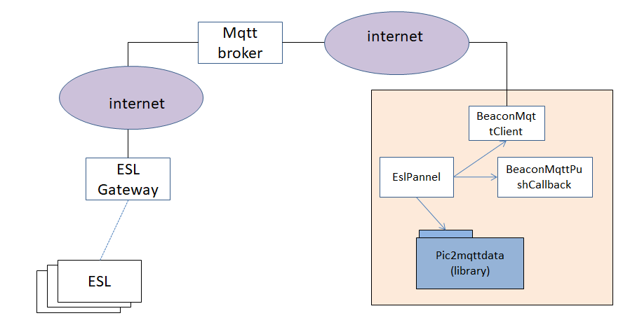
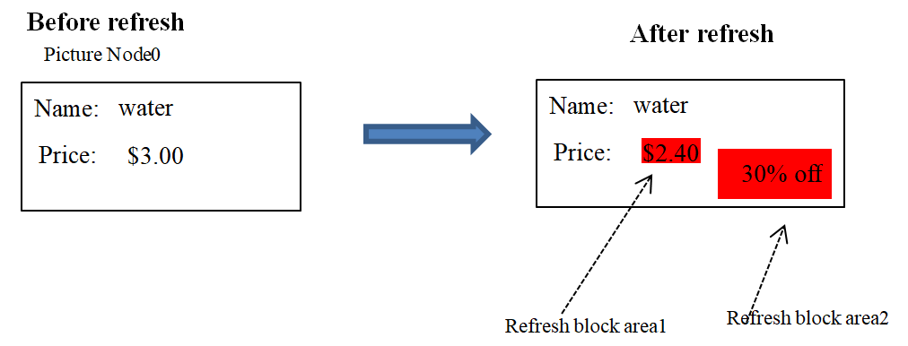

#KESL SDK Instruction DOC

## 1. Introduction
With this SDK, you can scan and update the ESL device. The SDK include follow main class:
* BeaconMqttClient: Responsible for connecting to the MQTT server;

* BeaconMqttPushCallback: Responsible for processing messages sent by Mqtt brokder. Through this class, the app can monitor the status of all ESL devices under the Gateway. Including ESL type (2.1, 2.9, etc.,), ESL signal, currently displayed picture ID, battery level, temperature and other information.

* EslPannel: The control class is responsible for UI display and image processing.

* pic2mqttdata package library: Responsible for converting bmp pictures content to ESL pixels format required by ESL.



## 2. How to test this Demo
please referance document <<HowToTestThisDemo.docx>>

## 3. How to use SDK
### 3.1 Monitor all devices(ESL) status
```Java
//monitor all esl device status
public int handleBeaconRpt(JSONObject cmdReqAgent)
{		
	try
	{
		//mac address
		String strGwAddress = cmdReqAgent.getString("gmac");
		strGwAddress = strGwAddress.toUpperCase();
		if (!isMacAddressValid(strGwAddress)){
			System.out.println("beacon mqtt input invalid error");
			return ERR_INVALID_INPUT;
		}

		//obj list
		JSONArray objArray = cmdReqAgent.getJSONArray("obj");
		if (objArray == null)
		{
			System.out.println("unknown obj data");
			return ERR_INVALID_INPUT;
		}


		//update mac
		for (int i = 0; i < objArray.size(); i++)
		{
			JSONObject obj = objArray.getJSONObject(i);

			//device mac address
			String strDevMac = obj.getString("dmac");
			if (strDevMac == null)
			{
				return ERR_INVALID_INPUT;
			}
			strDevMac = strDevMac.toUpperCase();
			if (!isMacAddressValid(strDevMac)){
				System.out.println("beacon mqtt input invalid error");
				return ERR_INVALID_INPUT;
			}

		   //esl rssi
			String strRssi = obj.getString("rssi");
			int nRssi = 0;
			if (strRssi != null)
			{
			    nRssi = Integer.valueOf(strRssi);
				if (nRssi >= 10){
					System.out.println("beacon mqtt input invalid error");
					return ERR_INVALID_INPUT;
				}
			}

			EslObject eslObj = mDeviceMap.get(strDevMac);
			ActionNotify nNotify = MqttConnNotify.ActionNotify.DEVICE_UPDATE;
			if (eslObj == null)
			{
				eslObj = new EslObject();
				eslObj.mMacAddress = strDevMac;
				nNotify = MqttConnNotify.ActionNotify.FOUND_DEVICE;
				mDeviceMap.put(strDevMac, eslObj);
			}

			eslObj.mRssi = nRssi;
			eslObj.mLastUpdateMsec = System.currentTimeMillis();

			//prase data
			if (!obj.has("type") || obj.getInt("type") != 64)
			{
				continue;
			}

			eslObj.mEslType = obj.getInt("eslType");
			eslObj.mEslVersion = obj.getInt("ver");
			eslObj.mFaltStatus = obj.getInt("stat");
			eslObj.mEslVoltage = obj.getInt("vatt");
			eslObj.mEslTemperature = obj.getInt("temp");
			eslObj.mPictureID = obj.getInt("picID");

			if (MqttConnNotify.ActionNotify.FOUND_DEVICE == nNotify)
			{
				System.out.println(getCurrentTime() + " Found new ESL,ID:" + strDevMac
						+ ",Rssi:" + nRssi
						+ ",Version:" + (int)eslObj.mEslVersion
						+ ",EslType:" + getEslType(eslObj.mEslType)
						+ ",Voltage:" + (int)eslObj.mEslVoltage + "mV"
						+ ",Temperature:" + (int)eslObj.mEslTemperature + "℃"
						+ ",PictureID:" + (int)eslObj.mPictureID);
			}

			mMqttNotify.actionNotify(nNotify, strDevMac, eslObj);
		}
	}
	catch (Exception e)
	{
		return ERR_INVALID_INPUT;
	}

	return ERR_PARSE_SUCCESS;
}
```

### 3.2 Download picture to device
ESL uses dot matrix pixel display. This SDK allows you to input BMP format pictures of the same size as the ESL screen, and then download the pictures to ESL.

Example: download bmp picture to device.
```Java
private boolean downBmpFile2Device(String strFilePath) {
		try {
			if (textDeviceID.getText().length() != 12) {
				textLogInfo.append("device id is null\r\n");
				return false;
			}

			int nESLType = this.comboSizeTypeBox.getSelectedIndex();
			MTagType tagType = MTagType.MTagTypeFromID(nESLType);
			if (tagType == null) {
				System.out.println("please select ESL Type");
				return false;
			}
			File file = new File(strFilePath);

			//save path
			String strDirectory = file.getParent();
			EslConfig.savePropertyValue(LAST_LOAD_JSON_FILE_PATH,
					strDirectory);

			//download file
			if (file.isFile() && file.exists()) {

				Pic2MqttDataService dataService = new Bmp2MqttDataService();
				String bmpZipString = dataService.getCompressData(file, tagType,
						124, 0);

				mJsonMsg = new JSONObject();
				mJsonMsg.put("msg", "dData");
				mJsonMsg.put("mac", textDeviceID.getText());
				mJsonMsg.put("seq", mMsgSequence++);
				mJsonMsg.put("auth1", "00000000");
				mJsonMsg.put("dType", "ascii");
				mJsonMsg.put("data", bmpZipString);

				mMqttClient.pubCommand2Gateway(mJsonMsg.toString());
			} else {
				System.out.println("File not exist");
			}
		} catch (Exception excpt) {
			excpt.printStackTrace();
		}

		return false;
	}
  ```

### 3.3 Partional picture update
Sometimes the app only need update partional picture. For example, the cloud only need to download the price area pixels dots when price changed.  


Example for download QR code to device
```Java
private void downQRCodeToDevice() {
		try {
			if (textDeviceID.getText().length() != 12) {
				System.out.println("device id length invalid");
				return;
			}

			//get esl type
			int nESLType = this.comboSizeTypeBox.getSelectedIndex();
			MTagType tagType = MTagType.MTagTypeFromID(nESLType);
			if (tagType == null) {
				System.out.println("please select ESL Type");
				return;
			}

		    //create qrcode bmp file
			ByteArrayOutputStream outputStream = new ByteArrayOutputStream();
			CreateQRCode.createQRcode(textDeviceID.getText(), outputStream);

			// create refresh block head
			PicturePartRefreshStru refreshStru = new PicturePartRefreshStru();
			refreshStru.lcdType = tagType;
			if (refreshStru.lcdType == null) {
				return;
			}
			refreshStru.nPartRefreshBkgColor = MTagType.LcdColorTranspant;
			refreshStru.nPictrueID = QRCODE_PICTURE_ID;
			refreshStru.nPictureNode = 0;
			refreshStru.appendRefreshBlock(0, 0, QRCODE_WIDTH, QRCODE_WIDTH,
					refreshStru.lcdType.getWidth() - QRCODE_WIDTH - 5, 5);

			//Convert QR code pictures to the message format required by ESL.
			Pic2MqttDataService dataService = new Bmp2MqttDataService();
			ByteArrayInputStream qrCodeStream = new ByteArrayInputStream(
					outputStream.toByteArray());
			outputStream.close();
			String bmpData = dataService.getPartionalCompressData(qrCodeStream,
					refreshStru);
			qrCodeStream.close();

			//send the json message to device
			mJsonMsg = new JSONObject();
			mJsonMsg.put("msg", "dData");
			mJsonMsg.put("mac", textDeviceID.getText());
			mJsonMsg.put("seq", mMsgSequence++);
			mJsonMsg.put("auth1", "00000000");
			mJsonMsg.put("dType", "ascii");
			mJsonMsg.put("data", bmpData);
			mMqttClient.pubCommand2Gateway(mJsonMsg.toString());
		} catch (Exception excpt) {
			excpt.printStackTrace();
		}
	}
  ```
